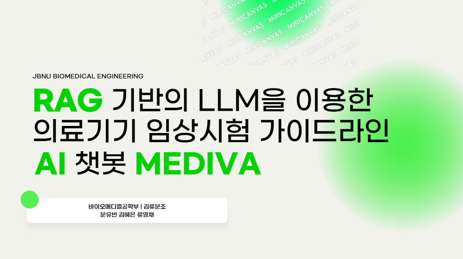

---

# MEDIVA

MEDIVA는 의료기기 임상시험 계획서 가이드라인을 제공하는 AI 챗봇입니다. (리드미 파일은 후에 더 수정할 예정)


## 발표영상

[](https://youtu.be/CUDP6FLetpE?si=Q2liz_PLPOYMHf9P)


## 목차

- [프로젝트 구조](#프로젝트-구조)
- [설치 방법](#설치-방법)
- [기여 방법](#기여-방법)


## 프로젝트 구조

프로젝트는 다음과 같은 파일과 디렉토리로 구성되어 있습니다:

- `ensemble.py`: 앙상블 학습 버전 챗봇
- `hash.py`: 해시 함수 및 관련 기능 제공
- `mmr.py`: MMR 알고리즘을 구현 버전 챗봇
- `multi-query.py`: 멀티 쿼리 처리 버전 챗봇 
- `requirements.txt`: 프로젝트에 필요한 라이브러리 목록이 포함되어 있습니다.
- `test.py`: 아무런 추가 기능을 적용하지 않은 초창기 MEDIVA 소스
- `update.py`: 해시를 이용해 추가된 문서가 있는 지 검증 후 새롭게 추가된 문서만을 임베딩하는 기능이 추가된 챗봇

## 설치 방법

1. 이 저장소를 클론합니다.

   ```bash
   git clone https://github.com/YUBIN-githubb/MEDIVA.git
   ```


2. 프로젝트 디렉토리로 이동합니다.

   ```bash
   cd MEDIVA
   ```


3. 가상환경을 생성합니다. (Anaconda Prompt)

   ```bash
   > conda create -n test_envs python=3.12
   ```


4. 가상환경을 활성화합니다.

   ```bash
   conda activate test_envs
   ```

5. 필요한 패키지를 설치합니다.

   ```bash
   pip install -r requirements.txt
   ```


5. 파일을 실행합니다.

   ```bash
   streamlit run test.py
   ```


## 기여 방법

기여를 환영합니다! 기여하시려면 다음 절차를 따라주세요.

1. 저장소를 포크합니다.


2. 새로운 브랜치를 생성합니다.

   ```bash
   git checkout -b feature/새로운기능
   ```


3. 변경 사항을 커밋합니다.

   ```bash
   git commit -m '새로운 기능 추가'
   ```


4. 브랜치에 푸시합니다.

   ```bash
   git push origin feature/새로운기능
   ```


5. 풀 리퀘스트를 생성합니다.

---